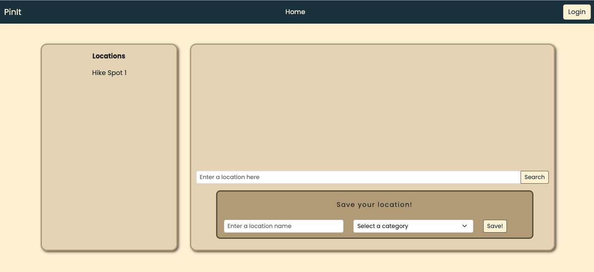

# PinIt
A web application designed to help keep track of a user's favorite spots!

## Description and Motivation

The PinIt app is a response to a need to have one place that would allow us to store our favorite places to visit. The user will be able to search for places to go (for example) hiking, or to a restaurant, or a travel destination and pin that place in their own profile. They will also be able to create Categories of the destinations they've saved and created. Once a user has a set of places they want to share, they will then be able to share it with other users their favorite places.




## Usage

This application is deployed to Heroku. Once you get to the page, you can create a login, search for destination and save them off to the side. The last 5 places you Pinned will be presented on the left along with your profile.

Here is the link to the Deployed Application ...
[PinIt App Is Deployed on Heroku](https://secret-badlands-45389-3dc2c54a2740.herokuapp.com//)


## Table of Contents

* [Technology Used](#technology-used)
* [Repo Location](#repo)
* [Screenshots of Application](screenshots-of-application)
* [Learning Points](#learning-points)
* [Code Snippets](#code-snippets)
* [Contact Info](#contact-info)

## Technology Used 

| Technology Used         | Resource URL           | 
| ------------- |:-------------:| 
| Google Maps Api | [https://developers.google.com/maps/documentation/javascript/](https://developers.google.com/maps/documentation/javascript)     |    
| Heroku | [https://www.heroku.com//](https://www.heroku.com/)     |    
| Git | [https://git-scm.com/](https://git-scm.com/)     |    
| NPM and ExpressJs | [https://www.npmjs.com/package/express](https://www.npmjs.com/package/express)|
| NodeJs | [https://nodejs.org/en](https://nodejs.org/en)|
| ChatGPT | [https://openai.com/blog/chatgpt](https://openai.com/blog/chatgpt)|
| GetBootstrap For CSS| [https://getbootstrap.com/](https://getbootstrap.com/)|

There is also javascript, Google Search, and Youtube university. 
## Repo 

[GitHub Repo for PinIt](https://github.com/stellyes/PinIt)


## Screenshots of Application
---
To get a better picture of what it is doing, or going to do, here are three snapshots to look at.

### Here is the opening page.

and a welcom apge


---
---
### When in profile page, you can see your saved pins

---


## Learning Points 

There is a huge learning curve for ExpressJs and handlbars. Not only database conections, but presenting forms through handlbars was very tough. The application actually deployed and starts up, but there were continues errors with GOOGLE API coming back with CORS problems. The app works without handlebars, but we tried dploying it without it.

### Some lessons a little more painful to add on it

We started out as a cohesive group with planning, getting our user stories in, setting up the Google project board. We got the general framework of the application done very quickly then life happened and we got slowed down in our working together. Eventually the app was having major issues with handlebars and thus is no longer a working application.

Git was a complainy thing and stopped us many times from getting code pushed or fixed. Called TAs several times.

Some things to change are: working on peices of the app seperately and deploy it without handlebars at first. Get it working, ask for help. Being oneline and working together would have helped along with tutors to fix stuff and ASKBCS.

## Code Snippets

There is a lot of stuff to this APP. We used ExpressJS, Sequelize, and Handlebars. Not only that, but there was a heavy usage of Google API for the searches that we needed and MYSQL running in the background.

### Set up of expressjs/sequelize/handlebars is pretty straight forward:
```js
const path = require("path");
const express = require("express");
const routes = require("./controllers");
const sequelize = require("./config/connection");
const session = require("express-session");
const SequelizeStore = require("connect-session-sequelize")(session.Store);
const handlebars = require("express-handlebars");

// Set up express instance and port
const app = express();
```

### Setting up Models for the DB, we have a User, Location, and Category Model.
```js
User.hasOne(Location, {
    foreignKey: 'user_id',
    onDelete: 'CASCADE'
});

Location.belongsTo(User, {
    foreignKey: 'user_id',
});

Location.belongsTo(Category, {
    foreignKey: 'category_id'
});

Category.hasMany(Location, {
    foreignKey: 'category_id'
});
```

### Within the User model, we use bcrypt as the hashing algorith for the passwords, along with hooks to update these in the User table.
```js
    hooks: {
      beforeBulkCreate: async (newUserDataGroup) => {
        for (const newUserData of newUserDataGroup) {
          newUserData.password = await bcrypt.hash(newUserData.password, 10);
        }
        return newUserDataGroup;
      },
      beforeBulkUpdate: async (updatedUserDataGroup) => {
        for (const updatedUserData of updatedUserDataGroup) {
          updatedUserData.password = await bcrypt.hash(updatedUserData.password, 10);
        }
        return newUserDataGroup;
      },
```

### Key Routes in this case allow us to route to a login page if not logged in, or /api usage for all the backend db work

```js
router.use("/", homeRoutes);
router.use("/api", apiRoutes);
...
router.use("/locations", locationRoutes);
router.use("/categories", categoryRoutes);
router.use("/users", userRoutes);

```

Not going to throw too much stuff here because there is a lot of code within theapplication. However, hereis a snippet of getting all Categories you stored, along with the locations and user info stored in it, when you hit the landing page.
```js
// Get all users
router.get("/",  async (req, res) => {
    try {
        const categoryData = await Category.findAll({
            include: [{ model: Location }, { model: User }]
        });

        res.status(200).json(categoryData);
    } catch(err) {
        res.status(500).json(err);
    }
});
```

---


## Contact Info

| Name      |Email      | Github    | Portfolio |
|-----------|-----------|-----------|-----------|
|Jason Savoie      |flimits@gmail.com|https://github.com/flimits|https://github.com/flimits/my-portfolio/|
|Ryan England       |me@rengland.org|https://github.com/stellyes||
|Christian Sanchez |christianes322@gmail.com|https://github.com/c-evsan22||


## Psuedo Code

The below was a psuedo coding exercise I did with others in order to come up with an attack plan of our to build the final touches on the Note-Taker application. 

### From the course story of what is required

* GIVEN a note-taking application
* WHEN I open the Note Taker
* THEN I am presented with a landing page with a link to a notes page
* WHEN I click on the link to the notes page
* THEN I am presented with a page with existing notes listed in the left-hand column, plus empty fields to enter a new note title and the note's text in the right-hand column
* WHEN I enter a new note title and the note's text
* THEN a "Save Note" button and a "Clear Form" button appear in the navigation at the top of the page
* WHEN I click on the Save button
* THEN the new note I have entered is saved and appears in the left-hand column with the other existing notes and the buttons in the navigation disappear
* WHEN I click on an existing note in the list in the left-hand column
* THEN that note appears in the right-hand column and a "New Note" button appears in the navigation
* WHEN I click on the "New Note" button in the navigation at the top of the page
* THEN I am presented with empty fields to enter a new note title and the note's text in the right-hand column and the button disappears

### Psuedo code part

* import express module to our server
* import require("./db/db.json")
* create app variable pointing to new express object(express())
* app.use(*middleware*){ -json, urlencoded, staticify(public)}
* 
* get/delete/post requests:
* 
* get request to send index.html, route: '/'
* get request to send notes.html, route: '/notes'
* 
* get request to fetch our api to send notes from db.json, route: '/api/notes'
* post request to fetch our api to modify with parsed req.body data and push post to db.json with fs.writeFile, route: '/api/notes', return res.json;
* delete request to delete specific note, *EXTRA CRED* remove specific data from db.json and push with fs.writeFile,  route: '/api/notes/:notes_id', return res.json;
* app.listen