# PinIt
A web application designed to help keep track of a user's favorite spots!

## Description and Motivation

The PinIt app is a response to a need to have one place that would allow us to store our favorite places to visit. The user will be able to search for places to go (for example) hiking, or to a restaurant, or a travel destination and pin that place in their own profile. They will also be able to create Categories of the destinations they've saved and created. Once a user has a set of places they want to share, they will then be able to share it with other users their favorite places.

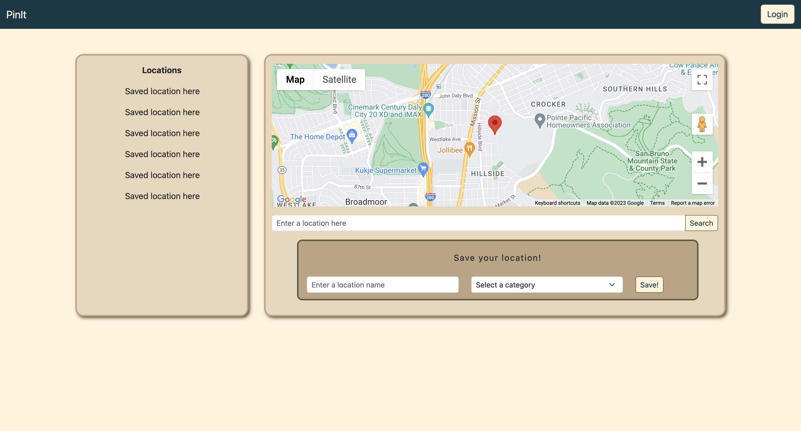

## Usage

This application is deployed to Heroku. Once you get to the page, you can create a login, search for destination and save them off to the side. The last 5 places you Pinned will be presented on the left along with your profile.

Here is the link to the Deployed Application ...
[PinIt App Is Deployed on Heroku](https://secret-badlands-45389-3dc2c54a2740.herokuapp.com)

## Table of Contents

* [User Stories](#user-stories)
* [Mockups](#mockups)
* [Technology Used](#technology-used)
* [API Research](#api-research)
* [CSS Framework](#css-framework)
* [Screenshots of Application and Code Highlights](#coding-highlights)
* [Learning Points](#learning-points)
* [Code Snippets](#code-snippets)
* [Code Challenges](#coding-challenges)
* [Future Developement](#future-developement)
* [Repo Location](#repo)
* [Contact Info](#contact-info)

## User Stories
These are the user stories that we used in order to plan, and execute on when creating the website. The user story will have 3 componets to them:
* As a <role>, I want <feature>, so that<reason>. Here is a summary of them.

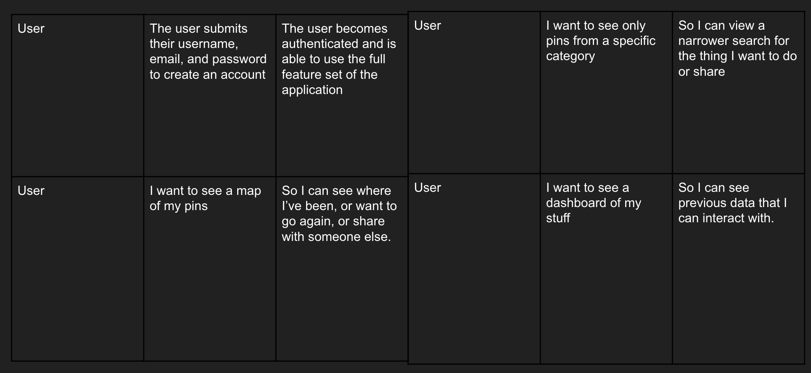
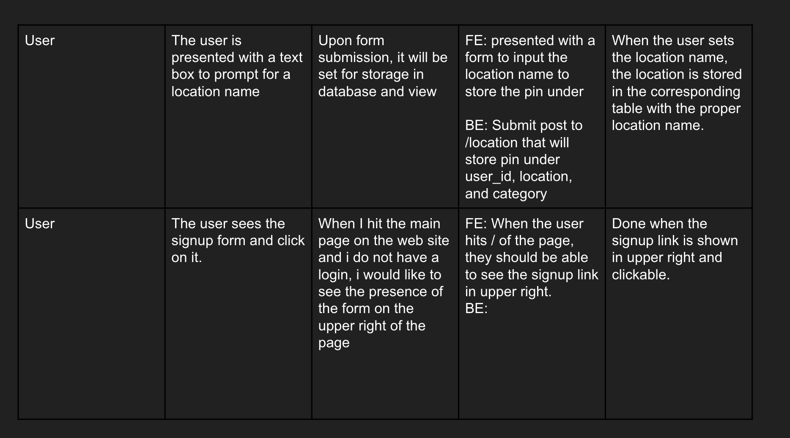
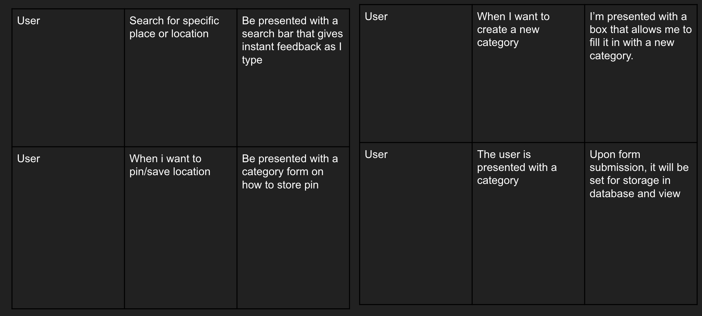
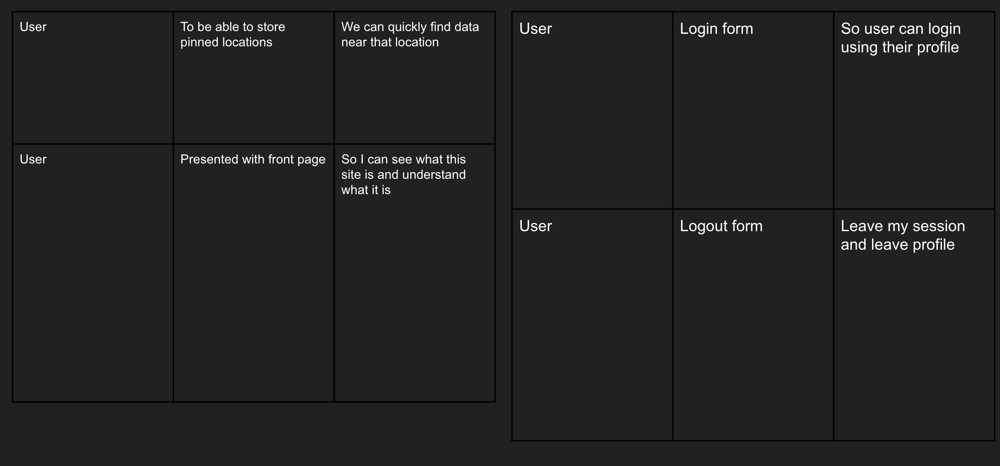

## Mockups

We created mockups of what we wanted. Basically, wanted a location, location history, search bars, a profile that shows us what we have saved and searched before. Also wanted to see login, signup and potential mapping.
 

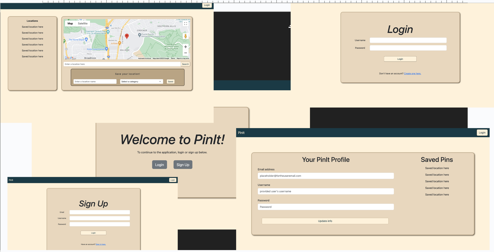

## Technology Used 

| Technology Used         | Resource URL           | 
| ------------- |:-------------:| 
| Google Maps Api | [https://developers.google.com/maps/documentation/javascript/](https://developers.google.com/maps/documentation/javascript)     |    
| Heroku | [https://www.heroku.com//](https://www.heroku.com/)     |    
| Git | [https://git-scm.com/](https://git-scm.com/)     |    
| NPM and ExpressJs | [https://www.npmjs.com/package/express](https://www.npmjs.com/package/express)|
| NodeJs | [https://nodejs.org/en](https://nodejs.org/en)|
| GetBootstrap For CSS| [https://getbootstrap.com/](https://getbootstrap.com/)|
| ChatGPT | [https://openai.com/blog/chatgpt](https://openai.com/blog/chatgpt)|

There is also javascript, Fetch/AJAX, CSS.
And some useful tools like Google Search, and Youtube university. 

## API Research

We researched many APIs that seemed appropriate for our site to function. Looked up restaurant apis, hiking, vacations, and other search apis. However, they mostly seemed very specific towards a genre of … food, or pointing to someone else site, or even a database of hiking trails … which would be fine, normally, but we found that the google maps API itself was pretty good had providing: restaurants, places of interest and addresses, along with pulling out coordinates and so on with it. So, that is what we stuck with. Here are a few we rejected:

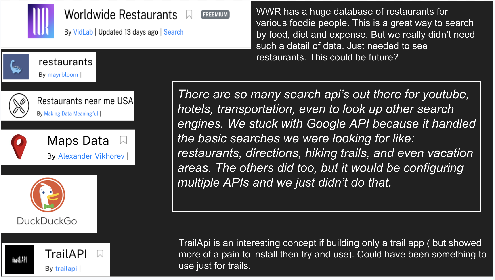

## CSS Framework

Animations in the CSS framework are from using 
* bootstrap toolkit and
* css keyframes & animation
* and lots of styling.
 
Key frames allow us to control the steps in a css sequence .. stepping through one picture at a time, and by how much. … which you will see shortly.
 
There two main blocks of code that we would like to highligh, and that is the animation of the login and the background of the page. The login grabs the attention of the user by moving around the page and the background images run like a carousel using javascript and recursion.
 
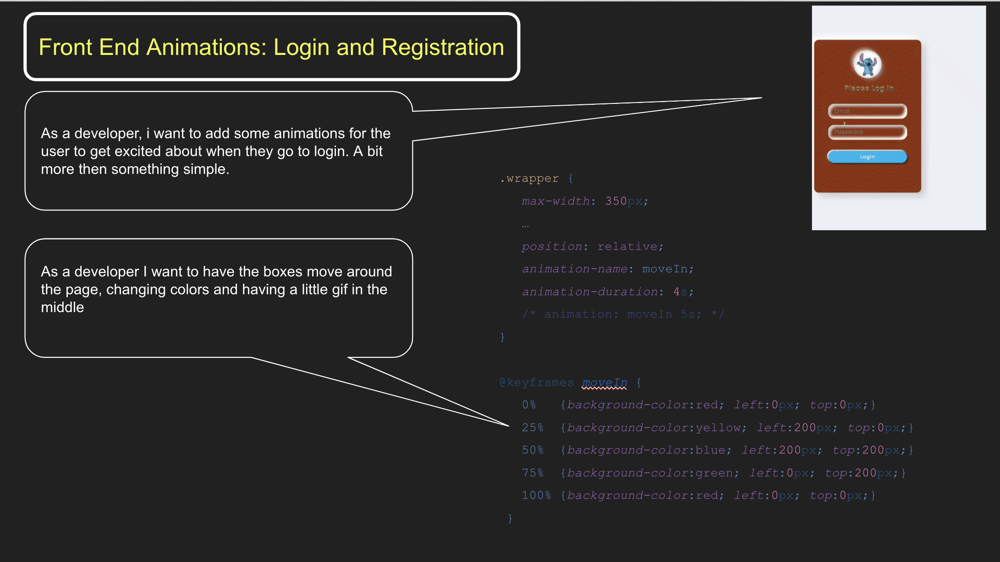
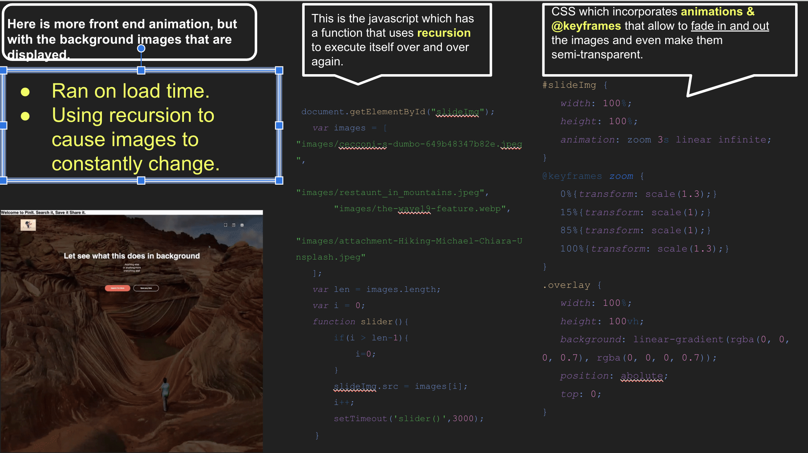

## Coding Highlights

### This highlight is for the Location and Autocomplete via Google API. As you type, it fills in the location.
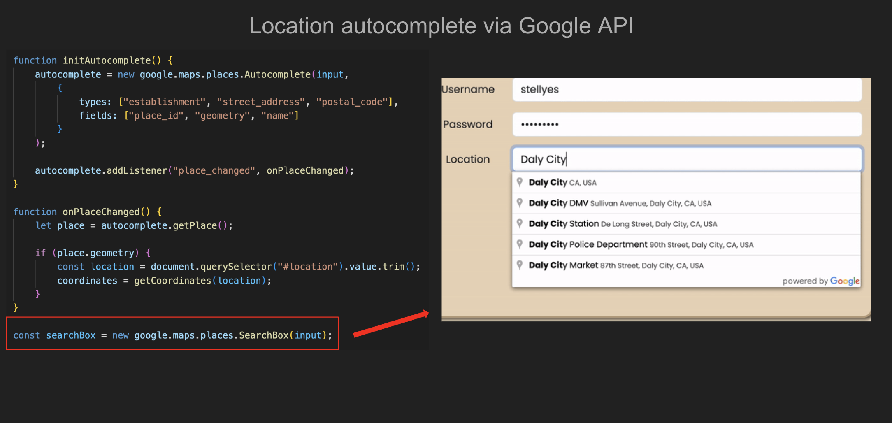
---
### We are able to parse longitude and latidude from the Google API object here
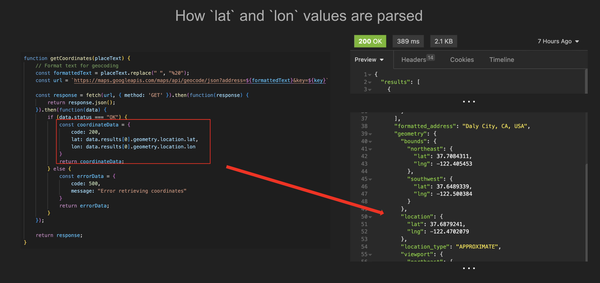

---
### Here is the code that allows us to know which user is accessing the dashboard
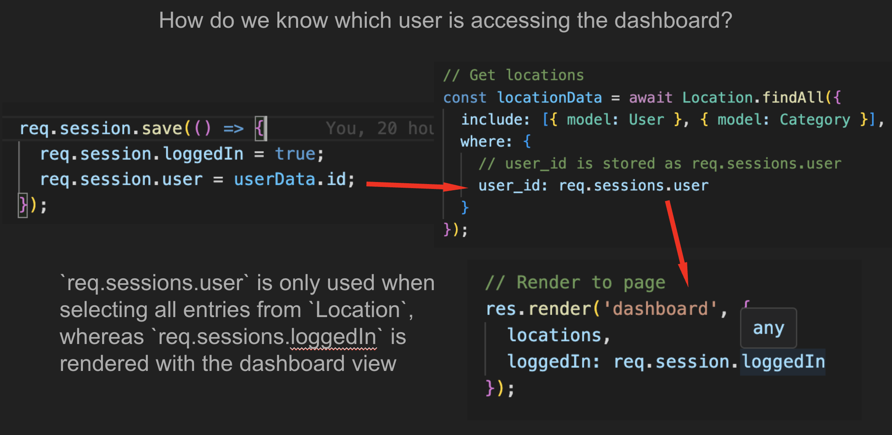

---
### Displaying the use of handelbars
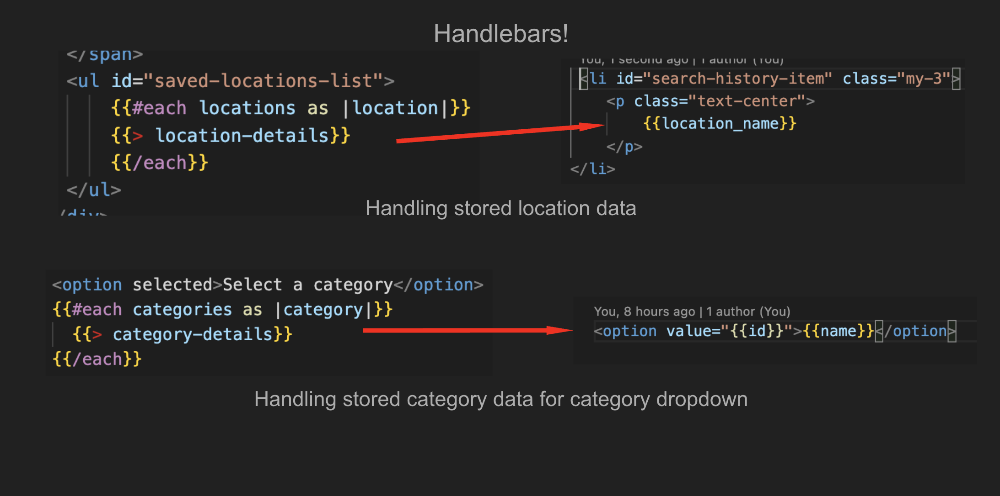

---
### 

## Coding Challenges

* Git problems, git problems, git problems
  * Neat git workflows are essential!
  * `git rebase` is not helpful, even though it may recommend it
  * Ensuring that every push to main doesn’t conflict with other developer’s code.
* Project scope vs. Developers
  * In the design process, clear delegation of development tasks was great at getting us going, but became disjointed when independent work was done

## Future developement
* Deployment, a working application
  * Debug handlebars
  * Attach remaining routes to front-end actionable elements
* Feature - Share locations, generate a link to view a user’s saved location 
* Feature - “Locality blogging”, since user’s home location is saved in user data, showing new/exciting posts from users within a ## mile radius!
* Styling - Having a more engaging UI 

## Learning Points 

There is a huge learning curve for ExpressJs and handlbars. Not only database conections, but presenting forms through handlbars was very tough. The application actually deployed and starts up, but there were continues errors with GOOGLE API coming back with CORS problems. The app works without handlebars, but we tried dploying it without it.

### Some lessons a little more painful to add on it

We started out as a cohesive group with planning, getting our user stories in, setting up the Google project board. We got the general framework of the application done very quickly then life happened and we got slowed down in our working together. Eventually the app was having major issues with handlebars and thus is no longer a working application.

Git was a complainy thing and stopped us many times from getting code pushed or fixed. Called TAs several times.

Some things to change are: working on peices of the app seperately and deploy it without handlebars at first. Get it working, ask for help. Being oneline and working together would have helped along with tutors to fix stuff and ASKBCS.

## Repo 
      
[GitHub Repo for PinIt](https://github.com/stellyes/PinIt)

## Contact Info

| Name      |Email      | Github    | Portfolio |
|-----------|-----------|-----------|-----------|
|Jason Savoie      |flimits@gmail.com|https://github.com/flimits|https://github.com/flimits/my-portfolio/|
|Ryan England       |me@rengland.org|https://github.com/stellyes||
|Christian Sanchez |christianes322@gmail.com|https://github.com/c-evsan22||
